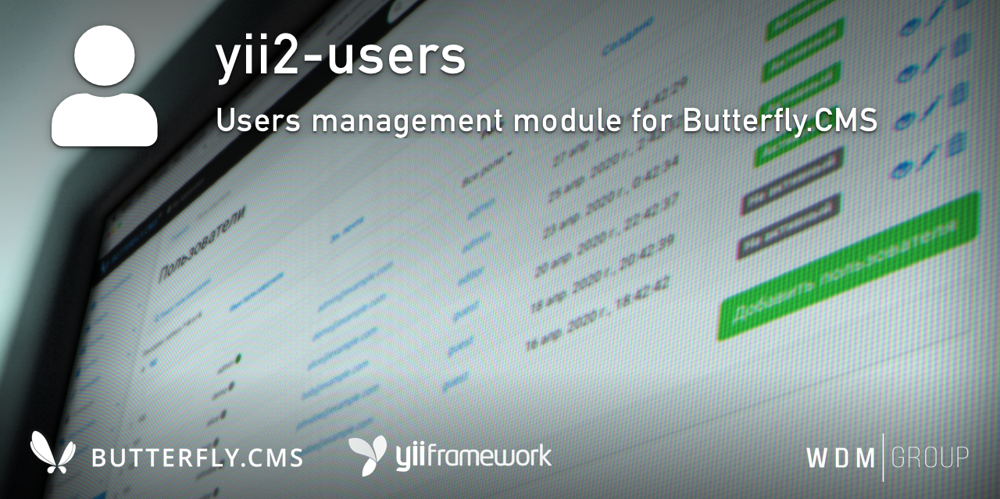

# Yii2 Users Module
Users management module

This module is an integral part of the [Butterfly.СMS](https://butterflycms.com/) content management system, but can also be used as an standalone extension.

Copyrights (c) 2019-2021 [W.D.M.Group, Ukraine](https://wdmg.com.ua/)

# Requirements 
* PHP 5.6 or higher
* Yii2 v.2.0.40 and newest
* [Yii2 Base](https://github.com/wdmg/yii2-base) module (required)

# Installation
To install the module, run the following command in the console:

`$ composer require "wdmg/yii2-users"`

After configure db connection, run the following command in the console:

`$ php yii users/init`

And select the operation you want to perform:
  1) Apply all module migrations
  2) Revert all module migrations
  3) Batch insert demo data*

\* - The demo database contains 6 demo user`s with:

| ID   | Username  | Password   | Email               | Status      |
| ---- | --------- | ---------- | ------------------- | ----------- |
| 100  | admin     | admin      | admin@example.com   | `active`    |
| 101  | demo      | demo       | demo@example.com    | `inactive`  |
| 102  | alice     | alice      | alice@example.com   | `inactive`  |
| 103  | bob       | bob        | bob@example.com     | `inactive`  |
| 104  | johndoe   | johndoe    | johndoe@example.com | `inactive`  |
| 105  | janedoe   | janedoe    | janedoe@example.com | `inactive`  |

# Migrations
In any case, you can execute the migration and create the initial data, run the following command in the console:

`$ php yii migrate --migrationPath=@vendor/wdmg/yii2-users/migrations`

# Configure

To add a module to the project, add the following data in your configuration file:

    
    'components' => [
        'user' => [
            'identityClass' => 'wdmg\users\models\Users',
        ],
        ...
    ],
    'modules' => [
        'users' => [
            'class' => 'wdmg\users\Module',
            'routePrefix' => 'admin',
            'rememberDuration' => (3600 * 24 * 30),
            'signupConfirmation' => [
                'needConfirmation' => false,
                'checkTokenRoute' => 'site/signup-confirm',
                'supportEmail' => 'noreply@example.com',
                'emailViewPath' => [
                    'html' => '@vendor/wdmg/yii2-users/mail/signupConfirmation-html',
                    'text' => '@vendor/wdmg/yii2-users/mail/signupConfirmation-text',
                ],
            ],
            'passwordReset' => [
                'resetTokenExpire' => 3600,
                'checkTokenRoute' => 'site/reset-password',
                'supportEmail' => 'noreply@example.com',
                'emailViewPath' => [
                    'html' => '@vendor/wdmg/yii2-users/mail/passwordReset-html',
                    'text' => '@vendor/wdmg/yii2-users/mail/passwordReset-text',
                ],
            ],
            'multiSignIn' => true,
            'sessionTimeout' => 0, // where `0` is unlimited
        ],
        ...
    ],

# Usage
See the [USECASES.md](https://github.com/wdmg/yii2-users/blob/master/USECASES.md) for more details.

# Routing
Use the `Module::dashboardNavItems()` method of the module to generate a navigation items list for NavBar, like this:

    <?php
        echo Nav::widget([
        'options' => ['class' => 'navbar-nav navbar-right'],
            'label' => 'Modules',
            'items' => [
                Yii::$app->getModule('users')->dashboardNavItems(),
                ...
            ]
        ]);
    ?>

# Status and version [ready to use]
* v.1.2.5 - Fixed: syntax error, unexpected '::' (T_PAAMAYIM_NEKUDOTAYIM)
* v.1.2.4 - Multiple Sign In`s and logoffs by session timeout
* v.1.2.3 - Unsupported array function fixed
* v.1.2.2 - Bugfix when RestAPI request
* v.1.2.1 - Bugfix when save user password
* v.1.2.0 - Users online, filter by role, assign/revoke user role, add/update user info